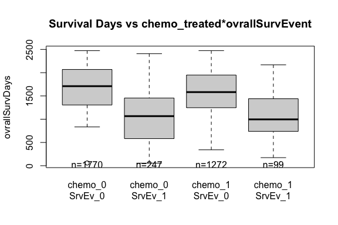
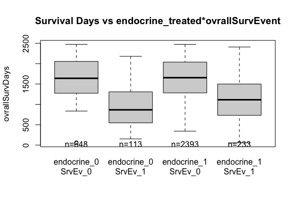
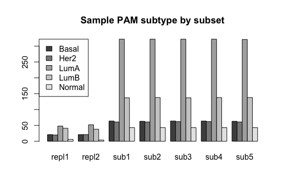
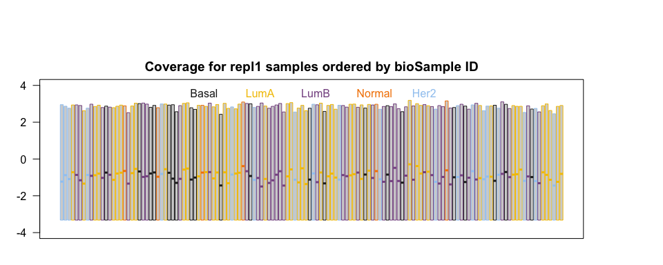
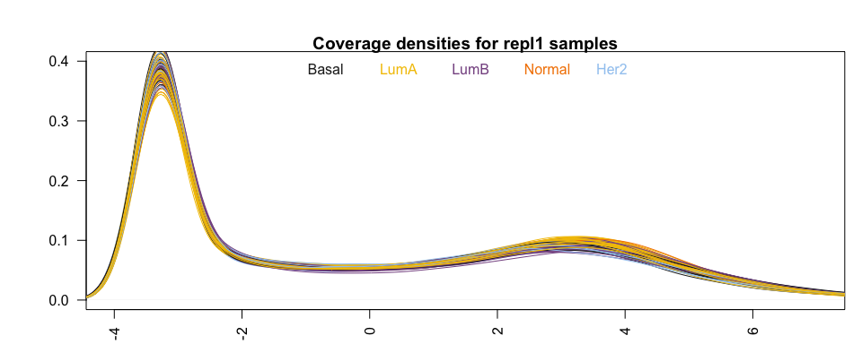
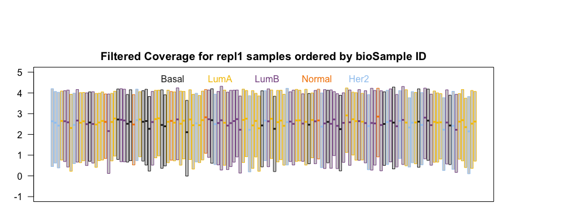
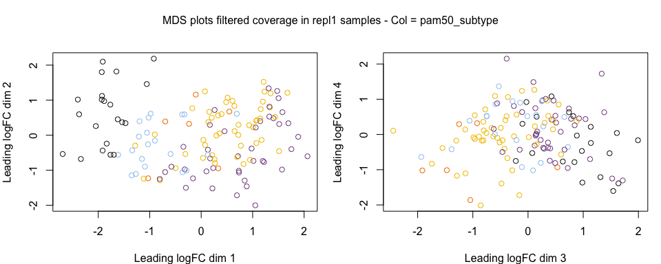

GSE96058 R Data Package
================

-----

<!--
[](https://travis-ci.com/12379Monty/GSE96058)
-->

<!-- README.md is generated from README.Rmd. Please edit that file -->

This package contains data from NCBI GEO [Series
GSE96058](https://www.ncbi.nlm.nih.gov/geo/query/acc.cgi?acc=GSE96058).
3,678 patients with breast cancer (BC) were studied. For 405 tumors, a
comprehensive multi-rater histopathologic evaluation was performed.
Using RNA-seq data, single-gene classifiers and multigene classifiers
(MGCs) were trained on consensus histopathology labels. Trained
classifiers were tested on a prospective population-based series of
3,273 BCs that included a median follow-up of 52 months (Sweden
Cancerome Analysis Network—Breast \[SCAN-B\], ClinicalTrials.gov
identifier: NCT02306096), and results were evaluated by agreement
statistics and Kaplan-Meier and Cox survival analyses. See Brueffer et
al. (2018) \[[1](#ref-Brueffer:2018aa)\] for a detailed report of the
findings.

### User notes

  - The data in NCBI GEO [Series
    GSE96058](https://www.ncbi.nlm.nih.gov/geo/query/acc.cgi?acc=GSE96058)
    does not contain any of the training samples discussed in the
    Brueffer et al. (2018) \[[1](#ref-Brueffer:2018aa)\] paper. This
    package therefore only contains samples from the prospective
    population-based series of 3,273 BCs.

  - The gene expression data are stored in several tables due to github
    file size restrictions:
    
      - featureCount\_repl1, featureCount\_repl2: 30865 x 136 tables of
        counts for replicated samples
      - featureCount\_sub1-\_sub5: 30865 x 626-629 tables of counts for
        random subsets of samples, balanced over pam scores.

  - We use `featureCount` although the gene coverage measures stored in
    the GEO data set are `FPKM` estimates of gene expression.

<br/>

## Installation

``` r
# install.packages("devtools")
devtools::install_github("12379Monty/GSE96058")
```

## Data sets

<table class="table" style="width: auto !important; margin-left: auto; margin-right: auto;">

<thead>

<tr>

<th style="text-align:left;">

Item

</th>

<th style="text-align:left;">

Title

</th>

</tr>

</thead>

<tbody>

<tr>

<td style="text-align:left;">

data\_processing

</td>

<td style="text-align:left;">

A data frame with one column describing data processing in GSE96058

</td>

</tr>

<tr>

<td style="text-align:left;">

featureCount\_repl1

</td>

<td style="text-align:left;">

A matrix of feature counts for replicated samples - replicate 1

</td>

</tr>

<tr>

<td style="text-align:left;">

featureCount\_repl2

</td>

<td style="text-align:left;">

A matrix of feature counts for replicated samples - replicate 2

</td>

</tr>

<tr>

<td style="text-align:left;">

featureCount\_sub1

</td>

<td style="text-align:left;">

A matrix of feature counts for a random subset of samples balanced
according to pam50 category

</td>

</tr>

<tr>

<td style="text-align:left;">

featureCount\_sub2

</td>

<td style="text-align:left;">

A matrix of feature counts for a random subset of samples balanced
according to pam50 category

</td>

</tr>

<tr>

<td style="text-align:left;">

featureCount\_sub3

</td>

<td style="text-align:left;">

A matrix of feature counts for a random subset of samples balanced
according to pam50 category

</td>

</tr>

<tr>

<td style="text-align:left;">

featureCount\_sub4

</td>

<td style="text-align:left;">

A matrix of feature counts for a random subset of samples balanced
according to pam50 category

</td>

</tr>

<tr>

<td style="text-align:left;">

featureCount\_sub5

</td>

<td style="text-align:left;">

A matrix of feature counts for a random subset of samples balanced
according to pam50 category

</td>

</tr>

<tr>

<td style="text-align:left;">

genes\_annot

</td>

<td style="text-align:left;">

A data frame describing the features

</td>

</tr>

<tr>

<td style="text-align:left;">

sampDesc

</td>

<td style="text-align:left;">

A data frame describing the samples in the GSE96058 dataset

</td>

</tr>

</tbody>

</table>

## Data Processing

The data processing step descriptions were extracted from the sample
table in the GSE96058 dataset and stored as a separate data from in the
GSE96058 data package; `data_processing`

``` r

library(GSE96058)

knitr::kable(data_processing,
  row.names=F)  %>%
  kableExtra::kable_styling(full_width = F)
```

<table class="table" style="width: auto !important; margin-left: auto; margin-right: auto;">

<thead>

<tr>

<th style="text-align:left;">

GSE96058\_Data\_Processing

</th>

</tr>

</thead>

<tbody>

<tr>

<td style="text-align:left;">

Base-calling using manufacturer’s on-instrument software.

</td>

</tr>

<tr>

<td style="text-align:left;">

Demultiplexing was done with Picard versions 1.120 or 1.128.
IlluminaBasecallsToFastq parameters used were
ADAPTERS\_TO\_CHECK=INDEXED, ADAPTERS\_TO\_CHECK=PAIRED\_END,
INCLUDE\_NON\_PF\_READS=false

</td>

</tr>

<tr>

<td style="text-align:left;">

Filtering to remove reads that align (using Bowtie 2 with default
parameters except -k 1 –phred33 –local) to ribosomal RNA/DNA (GenBank
loci NR\_023363.1, NR\_003285.2, NR\_003286.2, NR\_003287.2, X12811.1,
U13369.1), phiX174 Illumina control (NC\_001422.1), and sequences
contained in the UCSC RepeatMasker track (downloaded March 14, 2011).

</td>

</tr>

<tr>

<td style="text-align:left;">

Fragment size distribution (mean and width) for the alignment step was
estimated for each sample using bowtie2 2.2.3 and 2.2.5. Parameter set
during estimation were -fr, -k 1, –phred33, –local, and -u 100000, using
human genome assembly GRCh38.

</td>

</tr>

<tr>

<td style="text-align:left;">

Remaining reads were aligned using TopHat2 2.0.12 or 2.0.13 (default
parameters except for –mate-inner-dist X (estimated in previous step),
–mate-std-dev Y (estimated in previous step),
–library-type fr-firststrand, –no-coverage-search,
–max-insertion-length 20, –max-deletion-length 20, –read-gap-length
20, –read-edit-dist 22) to the human genome reference GRCh38 together
with 104,133 transcript annotations from the UCSC knownGenes table
(downloaded September 22, 2014).

</td>

</tr>

<tr>

<td style="text-align:left;">

Gene expression data in FPKM were generated using cufflinks 2.2.1
(default parameters except –GTF, –frag-bias-correct GRCh38.fa,
–multi-read-correct, –library-type fr-firststrand, –total-hits-norm,
–max-bundle-frags 10000000). The resulting data was was post-processed
by collapsing on 30,865 unique gene symbols (sum of FPKM values of each
matching transcript), adding to each expression measurement 0.1 FPKM,
and performing a log2 transformation.

</td>

</tr>

<tr>

<td style="text-align:left;">

PAM50 subtyping was performed using an implementation of the Parker
method (Parker et al., J.Clin Oncol 2009). In short, to avoid context
dependency when assigning PAM50 subtype by nearest-centroid, a fixed
reference was selected to match the original cohort used by Parker et
al. with respect to available clinical characteristics. Before subtyping
tumors in this study, gene expression of the PAM50 genes for each tumor
was centered to the reference set separately using custom R scripts.

</td>

</tr>

<tr>

<td style="text-align:left;">

Single-gene classifiers (SGCs) and multi-gene classifiers (MGCs) were
trained for ER, PgR, HER2, Ki67 (SGC and MGC) and NHG (MGC only) on the
expression of the single underlying gene (ESR1, PGR, ERBB2 or MKI67) or
multiple genes (5000 most varying genes across all samples) of a 405
sample cohort using consensus pathology scores as labels. Classifier
training was performed by selecting expression thresholds that maximize
prediction concordance to the consensus scores (SGCs) and nearest
shrunken centroids using the pamr R package (MGCs). The classifiers were
used to predict the biomarker status in a validation cohort of 3273
samples from patients enrolled in the SCAN-B study.

</td>

</tr>

<tr>

<td style="text-align:left;">

Genome\_build: Human genome reference GRCh38/hg38.

</td>

</tr>

<tr>

<td style="text-align:left;">

Supplementary\_files\_format\_and\_content: Gene expression in FPKM in
CSV format.

</td>

</tr>

</tbody>

</table>

## Examples

### ER/PR/HER2 status

  - To identify breast cancer associated read-through fusion
    transcripts, Varley et al. (2014) \[[2](#ref-Varley:2014aa)\]
    analyzed the paired-end RNA-seq data from of 168 breast samples,
    including 28 breast cancer cell lines, 42 triple negative breast
    cancer primary tumors, 42 estrogen receptor positive breast cancer
    primary tumors, and 56 non-malignant breast tissue samples. Data are
    deposited in [GEO
    GSE58135](https://www.ncbi.nlm.nih.gov/geo/query/acc.cgi?acc=GSE58135)

  - Analyzing this dataset Li et al. (2018) \[[3](#ref-Li:2018aa)\]
    identified 797 DEGs uniquely expressed in triple negative BC (TNBC)
    and 1403 DEGs uniquely expressed in estrogen positive and HER2
    negative BC (ER+HER2-BC).

This dataset has a limited number of TNBC and ER+HER2-BC that could be
examined to verify the findings in Li et al. (2018)
\[[3](#ref-Li:2018aa)\].

``` r

library(magrittr)
library(GSE96058)

ER_PR_HER2_tbl <- t(t(with(sampDesc %>% dplyr::filter(!isRepl), 
 table(ER_PR_HER2=paste(er_Status, pgr_Status, her2_Status, sep='_'),
  exclude=NULL)
 )))

 knitr::kable(t(t(ER_PR_HER2_tbl)),
  caption="ER, PR and HER2 Status")  %>%
  kableExtra::kable_styling(full_width = F)
```

<table class="table" style="width: auto !important; margin-left: auto; margin-right: auto;">

<caption>

ER, PR and HER2 Status

</caption>

<tbody>

<tr>

<td style="text-align:left;">

0\_0\_0

</td>

<td style="text-align:right;">

143

</td>

</tr>

<tr>

<td style="text-align:left;">

0\_0\_1

</td>

<td style="text-align:right;">

56

</td>

</tr>

<tr>

<td style="text-align:left;">

0\_0\_NA

</td>

<td style="text-align:right;">

12

</td>

</tr>

<tr>

<td style="text-align:left;">

0\_1\_0

</td>

<td style="text-align:right;">

22

</td>

</tr>

<tr>

<td style="text-align:left;">

0\_1\_1

</td>

<td style="text-align:right;">

6

</td>

</tr>

<tr>

<td style="text-align:left;">

0\_1\_NA

</td>

<td style="text-align:right;">

1

</td>

</tr>

<tr>

<td style="text-align:left;">

0\_NA\_1

</td>

<td style="text-align:right;">

1

</td>

</tr>

<tr>

<td style="text-align:left;">

1\_0\_0

</td>

<td style="text-align:right;">

126

</td>

</tr>

<tr>

<td style="text-align:left;">

1\_0\_1

</td>

<td style="text-align:right;">

44

</td>

</tr>

<tr>

<td style="text-align:left;">

1\_0\_NA

</td>

<td style="text-align:right;">

5

</td>

</tr>

<tr>

<td style="text-align:left;">

1\_1\_0

</td>

<td style="text-align:right;">

2198

</td>

</tr>

<tr>

<td style="text-align:left;">

1\_1\_1

</td>

<td style="text-align:right;">

232

</td>

</tr>

<tr>

<td style="text-align:left;">

1\_1\_NA

</td>

<td style="text-align:right;">

90

</td>

</tr>

<tr>

<td style="text-align:left;">

1\_NA\_0

</td>

<td style="text-align:right;">

101

</td>

</tr>

<tr>

<td style="text-align:left;">

1\_NA\_1

</td>

<td style="text-align:right;">

34

</td>

</tr>

<tr>

<td style="text-align:left;">

1\_NA\_NA

</td>

<td style="text-align:right;">

2

</td>

</tr>

<tr>

<td style="text-align:left;">

NA\_1\_0

</td>

<td style="text-align:right;">

2

</td>

</tr>

<tr>

<td style="text-align:left;">

NA\_1\_1

</td>

<td style="text-align:right;">

3

</td>

</tr>

<tr>

<td style="text-align:left;">

NA\_NA\_0

</td>

<td style="text-align:right;">

139

</td>

</tr>

<tr>

<td style="text-align:left;">

NA\_NA\_1

</td>

<td style="text-align:right;">

44

</td>

</tr>

<tr>

<td style="text-align:left;">

NA\_NA\_NA

</td>

<td style="text-align:right;">

12

</td>

</tr>

</tbody>

</table>

<br/>

### ER status vs predicted value

  - The GSE58135 dataset contains single gene and multi gene predictors
    of ER/PR/HER2/ki67 status:  
    \- er\_Status, her2\_Status, ki67\_Status, pgr\_Status  
    \- er\_SGC, her2\_SGC, ki67\_SGC, pgr\_SGC  
    \- er\_MGC, her2\_MGC, ki67\_MGC, nhg\_MGC, pgr\_MGC

<!-- end list -->

``` r

SGC_tbl <- with(sampDesc,
 table(er_Status, er_SGC)
)
dimnames(SGC_tbl)[[1]] <- paste0('ER=', dimnames(SGC_tbl)[[1]])

MGC_tbl <- with(sampDesc,
 table(er_Status, er_MGC)
)
dimnames(MGC_tbl)[[1]] <- paste0('ER=', dimnames(MGC_tbl)[[1]])


knitr::kable(SGC_tbl, caption='ER Status - SGC Predictions')  %>%
  kableExtra::kable_styling(full_width = F)
```

<table class="table" style="width: auto !important; margin-left: auto; margin-right: auto;">

<caption>

ER Status - SGC Predictions

</caption>

<thead>

<tr>

<th style="text-align:left;">

</th>

<th style="text-align:right;">

0

</th>

<th style="text-align:right;">

1

</th>

</tr>

</thead>

<tbody>

<tr>

<td style="text-align:left;">

ER=0

</td>

<td style="text-align:right;">

192

</td>

<td style="text-align:right;">

62

</td>

</tr>

<tr>

<td style="text-align:left;">

ER=1

</td>

<td style="text-align:right;">

65

</td>

<td style="text-align:right;">

2870

</td>

</tr>

<tr>

<td style="text-align:left;">

ER=NA

</td>

<td style="text-align:right;">

137

</td>

<td style="text-align:right;">

83

</td>

</tr>

</tbody>

</table>

``` r

knitr::kable(MGC_tbl, caption='ER Status - MGC Predictions')  %>%
  kableExtra::kable_styling(full_width = F)
```

<table class="table" style="width: auto !important; margin-left: auto; margin-right: auto;">

<caption>

ER Status - MGC Predictions

</caption>

<thead>

<tr>

<th style="text-align:left;">

</th>

<th style="text-align:right;">

0

</th>

<th style="text-align:right;">

1

</th>

</tr>

</thead>

<tbody>

<tr>

<td style="text-align:left;">

ER=0

</td>

<td style="text-align:right;">

242

</td>

<td style="text-align:right;">

12

</td>

</tr>

<tr>

<td style="text-align:left;">

ER=1

</td>

<td style="text-align:right;">

246

</td>

<td style="text-align:right;">

2689

</td>

</tr>

<tr>

<td style="text-align:left;">

ER=NA

</td>

<td style="text-align:right;">

205

</td>

<td style="text-align:right;">

15

</td>

</tr>

</tbody>

</table>

Similarly for PGR, HER2 and ki67.

<br/>

### Treatment and survival.

  - The GSE58135 dataset contains treatment and survival data

<!-- end list -->

``` r
 ###, fig.cap="Survival Days vs chemo_treated*ovrallSurvEvent"}

chemo_surv_lst <- with(sampDesc %>% dplyr::filter(chemo_treated %in% c('0','1')),
  split(ovrallSurvDays, 
   paste0('chemo_',chemo_treated, '\nSrvEv_', ovrallSurvEvent))
)

boxplot(chemo_surv_lst, ylab='ovrallSurvDays')
title("Survival Days vs chemo_treated*ovrallSurvEvent")
```



Can similarly examine survival vs endocrine\_treated.

``` r
 ###, fig.cap="Survival Days vs endocrine_treated*ovrallSurvEvent",eval=F, echo=F}

endocrine_surv_lst <- with(sampDesc %>% dplyr::filter(endocrine_treated %in% c('0','1')),
  split(ovrallSurvDays, 
   paste0('endocrine_',endocrine_treated, '\nSrvEv_', ovrallSurvEvent))
)

boxplot(endocrine_surv_lst, ylab='ovrallSurvDays')
title("Survival Days vs endocrine_treated*ovrallSurvEvent")
```



<br/>

### PAM50 subtyping

  - GSE96058 has PAM50 subtypung information - see data processing
    above. Samples were distributed across different count tables in
    order to meet github file size constraints. This allocation was done
    to keep the PAM50 score distribution constant.

<!-- end list -->

``` r
 ###, fig.cap="Sapmple PAM subtype vs Count Table" }

pam50_byTable_tbl <- with(sampDesc,
 table(pam50_subtype, countTable))

barplot(pam50_byTable_tbl, beside=T, legend=T, args.legend=list(x='topleft'))
title("Sample PAM subtype by subset")
```



Let’s examine how counts cluster for one of the subsets.

First look at coverage, ordered by sample ID (sometimes a proxy for
processing time effects)

``` r
###, fig.cap="Coverage for repl1 samples ordered by bioSample ID"}
KellyColors.vec <- c(
  "#222222", "#F3C300", "#875692", "#F38400", "#A1CAF1",
  "#BE0032", "#C2B280", "#848482", "#008856", "#E68FAC", "#0067A5",
  "#F99379", "#604E97", "#F6A600", "#B3446C", "#DCD300", "#882D17",
  "#8DB600", "#654522", "#E25822", "#2B3D26"
)
col_vec <- KellyColors.vec

pamVal_vec <- with(sampDesc, unique(pam50_subtype))
pamCol_vec <- col_vec[1:length(pamVal_vec)]
names(pamCol_vec) <- pamVal_vec

sampDesc_repl1 <- sampDesc[match(colnames(featureCount_repl1), sampDesc$title),]

o.v <- order(sampDesc_repl1$bioSample)

sampDesc_repl1 <- sampDesc_repl1[o.v,]
featureCount_repl1 <- featureCount_repl1[, o.v]
rm(o.v)

par(mfrow = c(1, 1), mar = c(2, 2, 2, 4), oma = c(0, 1, 4, 2))

# AqNPATisMix outline=T for LBO
boxplot(featureCount_repl1,
  add = F,
  ylim = c(-4, 4), 
  staplewex = 0, # remove horizontal whisker lines
  staplecol = "white", # just to be totally sure
  outline = F, # remove outlying points
  whisklty = 0, # remove vertical whisker lines
  las = 2, horizontal = F, xaxt = "n",
  border = pamCol_vec[sampDesc_repl1$pam50_subtype])
title("Coverage for repl1 samples ordered by bioSample ID")

legend('top', text.col=pamCol_vec, legend=names(pamCol_vec), bty='n', horiz=T)
```



``` r
###, fig.cap="Coverage densities for repl1 samples"}

par(mfcol = c(1, 1), mar = c(2, 2, 1, 1), oma = c(0, 3, 2, 0))


plot(density(featureCount_repl1[, 1]),
  col = pamCol_vec[sampDesc_repl1$pam50_subtype[1]],
  lty = 1, lwd = 2, 
  xlim = c(-4, 7), ylim = c(0, .4), las = 2, main = "", xlab = ""
)
title("Coverage densities for repl1 samples")

for (JJ in 2:ncol(featureCount_repl1)) {
  den <- density(featureCount_repl1[, JJ])
  lines(den$x, den$y,
    col = pamCol_vec[sampDesc_repl1$pam50_subtype[JJ]],
    lty = 1)
}

legend('top', text.col=pamCol_vec, legend=names(pamCol_vec), bty='n', horiz=T)
```



FPKM of zero looks like a good place to separate expressed from weakly
expressed genes. Apply this filter, requiring at a gene to be epxressed
beyond this nominal value in at least 10 samples to be considered for
this analysis.

``` r
   ### , fig.cap="Filtered Coverage for repl1 samples orderd bi bioSample ID"}

weak.flg <- rowSums(featureCount_repl1 > 0)  < 10

cat("Excluding", round(100*mean(weak.flg),1), "percent of genes.\n")
#> Excluding 44.5 percent of genes.
cat(sum(!weak.flg), 'genes kept for analysis.\n')
#> 17115 genes kept for analysis.

par(mfrow = c(1, 1), mar = c(2, 2, 2, 4), oma = c(0, 1, 4, 2))

# AqNPATisMix outline=T for LBO
boxplot(featureCount_repl1[!weak.flg,],
  add = F,
  ylim = c(-1, 5), 
  staplewex = 0, # remove horizontal whisker lines
  staplecol = "white", # just to be totally sure
  outline = F, # remove outlying points
  whisklty = 0, # remove vertical whisker lines
  las = 2, horizontal = F, xaxt = "n",
  border = pamCol_vec[sampDesc_repl1$pam50_subtype])
title("Filtered Coverage for repl1 samples ordered by bioSample ID")

legend('top', text.col=pamCol_vec, legend=names(pamCol_vec), bty='n', horiz=T)
```



``` r
   ### , fig.cap='MDS plots filtered coverage in repl1 samples', echo=T}

par(mfcol = c(1, 2), mar = c(4, 4, 2, 1), xpd = NA, oma = c(0, 0, 2, 0))

MDS.out <- limma::plotMDS(featureCount_repl1[!weak.flg,],
  col = pamCol_vec[sampDesc_repl1$pam50_subtype],
  pch=1
)


MDS.out <- limma::plotMDS(featureCount_repl1[!weak.flg,],
  col = pamCol_vec[sampDesc_repl1$pam50_subtype],
  pch=1,
  dim.plot = 3:4
)

mtext(outer=T, side=3,
 "MDS plots filtered coverage in repl1 samples - Col = pam50_subtype")
```



We see some association with pam subtype, but no strong clustering in
this display.

## Package page

  - <https://12379monty.github.io/GSE96058/>

<!-- DOESNT WORK WITH GITHUB
## References
<div id="refs"></div>
-->

-----

Please note that the ‘GSE96058’ project is released with a [Contributor
Code of Conduct](.github/CODE_OF_CONDUCT.md). By contributing to this
project, you agree to abide by its terms.

-----

## References

<div id="refs" class="references">

<div id="ref-Brueffer:2018aa">

1\. Brueffer, C., Vallon-Christersson, J., Grabau, D., Ehinger, A.,
Häkkinen, J., Hegardt, C., Malina, J., Chen, Y., Bendahl, P.-O., and
Manjer, J. *et al.* Clinical value of rna sequencing-based classifiers
for prediction of the five conventional breast cancer biomarkers: A
report from the population-based multicenter sweden cancerome analysis
network-breast initiative. JCO precision oncology *2*, PO.17.00135.
Available at: <https://pubmed.ncbi.nlm.nih.gov/32913985>.

</div>

<div id="ref-Varley:2014aa">

2\. Varley, K.E., Gertz, J., Roberts, B.S., Davis, N.S., Bowling, K.M.,
Kirby, M.K., Nesmith, A.S., Oliver, P.G., Grizzle, W.E., and Forero, A.
*et al.* (2014). Recurrent read-through fusion transcripts in breast
cancer. Breast Cancer Research and Treatment *146*, 287–297. Available
at: <https://doi.org/10.1007/s10549-014-3019-2>.

</div>

<div id="ref-Li:2018aa">

3\. Li, X., Rouchka, E.C., Brock, G.N., Yan, J., O’Toole, T.E., Tieri,
D.A., and Cooper, N.G.F. A combined approach with gene-wise
normalization improves the analysis of rna-seq data in human breast
cancer subtypes. PloS one *13*, e0201813–e0201813. Available at:
<https://www.ncbi.nlm.nih.gov/pubmed/30089167>.

</div>

</div>

<!--

Rscript -e "rmarkdown::render('README.Rmd')"

# nohup Rscript -e "rmarkdown::render('README.Rmd')" > README.log  &


-->
